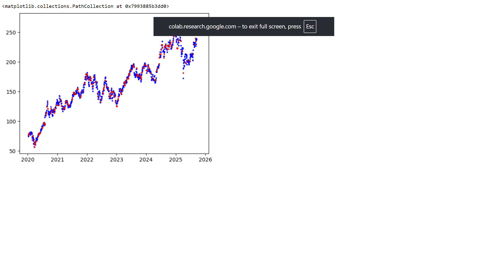
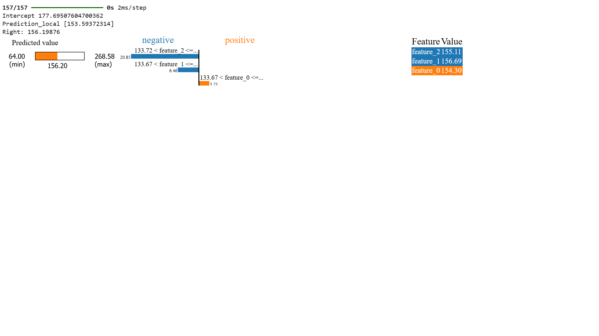

# 📈 Stock Price Prediction and Explainable AI (XAI)

## 🧩 Overview
This project focuses on predicting stock prices using Machine Learning and interpreting model decisions through Explainable AI (XAI) techniques.  
It aims to understand the key factors influencing predictions while maintaining transparency and trust in model decisions.

---

## 🗂️ 1. Data Collection
Stock market data for **Apple (AAPL)** was collected from **2020 to 2025** using the Yahoo Finance API.  
The dataset includes key parameters such as Date, Open, High, Low, Close, Volume, and Adjusted Prices.  
This data forms the foundation for all subsequent preprocessing and model training steps.

---

## 🧹 2. Data Preprocessing
Data preprocessing involves cleaning and transforming the raw dataset to ensure high-quality inputs for the model.  
The main steps include:
- Handling missing or inconsistent values.  
- Applying normalization or standardization for numerical stability.  
- Generating technical indicators like RSI, EMA, and MACD.  
- Splitting the dataset into training and testing subsets.

This step ensures that the input data is structured and ready for model training.

---

## 🧠 3. Model Architecture
The project employs a **Long Short-Term Memory (LSTM)** neural network, a specialized deep learning model ideal for time-series data such as stock prices.  
LSTM layers capture the sequential dependencies in stock movement, while dense layers output the final predicted value.  
This design helps the model learn temporal patterns effectively and predict future price trends based on past data.

---

## ⚙️ 4. Training and Evaluation
The model is trained using optimized parameters to minimize prediction error.  
The training phase involves multiple iterations to improve model accuracy, followed by evaluation using performance metrics such as RMSE, MAE, and R² Score.  
Predicted prices are compared against real stock prices to assess model performance visually and statistically.

### 📊 Model Prediction Visualization

The blue points represent the actual stock prices, while the red points represent predicted prices.  
The close alignment between them demonstrates the model’s strong predictive ability.

---

## 🧩 5. Explainable AI (XAI)
To ensure interpretability and trust in the model, Explainable AI (XAI) methods such as **SHAP** and **LIME** are applied.  
These methods help identify how individual features contribute to each prediction, showing whether a factor increases or decreases the predicted price.

### 🔍 Local Prediction Explanation

In the visualization above, orange bars indicate positive contributions that push the price higher, while blue bars represent negative effects that lower the predicted price.  
This provides a clear understanding of feature influence at a local (individual prediction) level.

### 🌍 Global Feature Importance

This visualization represents the overall contribution of each feature across the entire dataset.  
It helps identify which indicators are most significant for the model’s overall behavior.

---

## 📊 Results Summary

| Metric | Value |
|--------|--------|
| RMSE | ~7.3 |
| MAE | ~5.2 |
| R² Score | 0.92 |

The model achieves strong predictive accuracy and interpretability, demonstrating the power of LSTM combined with XAI for financial forecasting.

---

## 🧠 Key Learnings
- LSTM effectively captures complex temporal patterns in stock market data.  
- Explainable AI enhances trust and interpretability by showing feature-level contributions.  
- The integration of deep learning and XAI techniques leads to both accuracy and transparency in financial modeling.

---

## 🧾 References
- Yahoo Finance API  
- TensorFlow and Keras  
- SHAP and LIME libraries for Explainable AI  
- Matplotlib and Seaborn for data visualization  

---

## 💻 Author
**Mohammed Ikram**  
📅 Year: 2025  
🔗 Environment: Google Colab  

---
